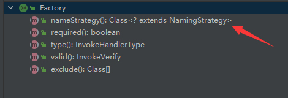
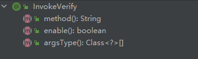

# spring-tools

> * 将一个接口多个实现的Beans代理成工厂类
> 1. 在需要被代理成工厂类的类属性上加上  @Factory  注解
     > , 在调用被代理类时首先会从工厂中获取所有的NameStrategy接口实现类, 调用support方法, 当任意一个接
     > 口的support返回true,则调用该接口的getName方法来获取bean的名字,来达到获取目标bean的目的. 该逻辑
     > 的具体实现可由用户完成, 但如果用户不实现该接口, 调用org.designer.di.strategy.impl.ThreadLocalNamingStrategy将线程变量进行赋值,
     > 则优先调用该接口 
>
> 2. 但可能有这样的业务需求: 在多个接口实现类中对特定的接口进行方法拦截校验,可通过注解  @InvokeVerify
     > 进行判断, 实现方式与MyBatis中的插件拓展类似

> * 
